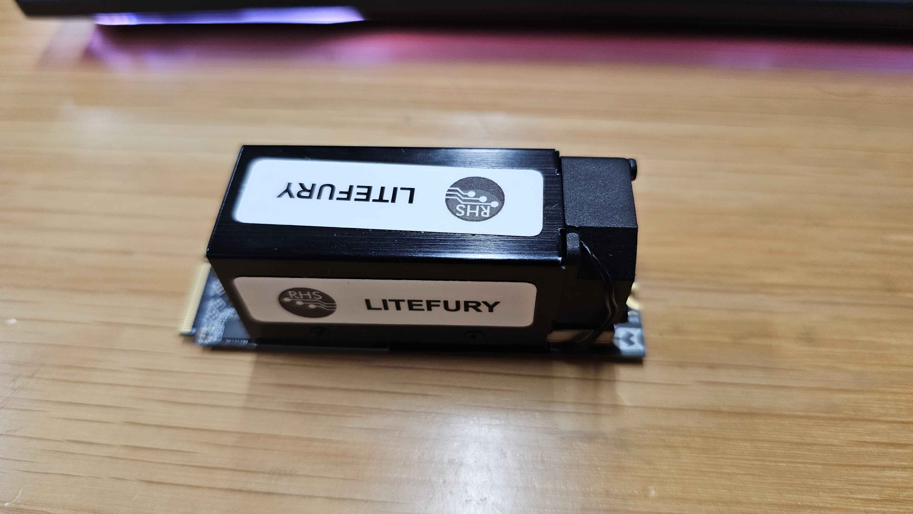

# Use LiteX on the Acorn CLE 215

# Acorn CLE 101

The Acorn CLE 101 is a cryptocurrency mining accelerator card from SQRL that can be repurposed as a generic FPGA PCIe development board:

It features:

- An Artix7 XC7A200T speedgrade -3.
- A 16-bit / 1 GiB DDR3.
- A 32MiB QSPI Flash.
- A PCIe Gen2 X4 M2 connector (exposing the 4 GTP transceivers! - up to 6.6 Gb/s)
- 4 User leds.
- A JTAG connector.
- 4 General purpose IOs.
- 4 LVDS pairs IOs.

The Acorn CLE215+ is in fact the NiteFury board with more memory: 1GB instead of 512MB. Both NiteFury and LiteFury boards are really interesting boards, but what makes the Acorn CLE215+ even more interesting is that it's available for very cheap: from ~60 euros to 100 euros on eBay at the time we write this Wiki page... The boards can be found at these prices since no longer useful in cryptocurrency mining... but still interesting for us as FPGA dev boards :)
